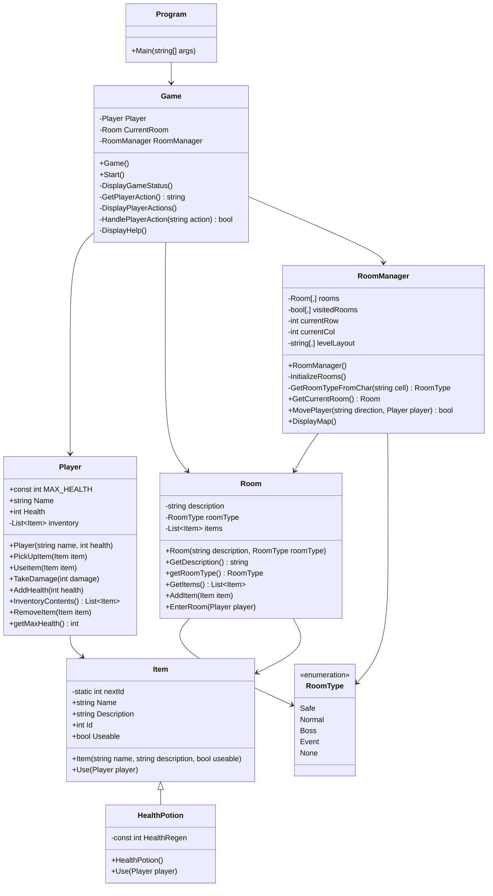

# DungeonExplorer -- CMP1903M - 2425 

```mermaid
classDiagram
    class Program {
        +Main(string[] args)
    }

    class Game {
        -Player Player
        -Room CurrentRoom
        -RoomManager RoomManager
        +Game()
        +Start()
        -DisplayGameStatus()
        -GetPlayerAction() string
        -DisplayPlayerActions()
        -HandlePlayerAction(string action) bool
        -DisplayHelp()
    }

    class RoomManager {
        -Room[,] rooms
        -bool[,] visitedRooms
        -int currentRow
        -int currentCol
        -string[,] levelLayout
        +RoomManager()
        -InitializeRooms()
        -GetRoomTypeFromChar(string cell) RoomType
        +GetCurrentRoom() Room
        +MovePlayer(string direction, Player player) bool
        +DisplayMap()
    }

    class Room {
        -string description
        -RoomType roomType
        -List~Item~ items
        +Room(string description, RoomType roomType)
        +GetDescription() string
        +getRoomType() RoomType
        +GetItems() List~Item~
        +AddItem(Item item)
        +EnterRoom(Player player)
    }

    class Player {
        +const int MAX_HEALTH
        +string Name
        +int Health
        -List~Item~ inventory
        +Player(string name, int health)
        +PickUpItem(Item item)
        +UseItem(Item item)
        +TakeDamage(int damage)
        +AddHealth(int health)
        +InventoryContents() List~Item~
        +RemoveItem(Item item)
        +getMaxHealth() int
    }

    class Item {
        -static int nextId
        +string Name
        +string Description
        +int Id
        +bool Useable
        +Item(string name, string description, bool useable)
        +Use(Player player)
    }

    class HealthPotion {
        -const int HealthRegen
        +HealthPotion()
        +Use(Player player)
    }

    class RoomType {
        <<enumeration>>
        Safe
        Normal
        Boss
        Event
        None
    }

    Program --> Game
    Game --> Player
    Game --> Room
    Game --> RoomManager
    RoomManager --> Room
    RoomManager --> RoomType
    Room --> RoomType
    Room --> Item
    Player --> Item
    Item <|-- HealthPotion

```
